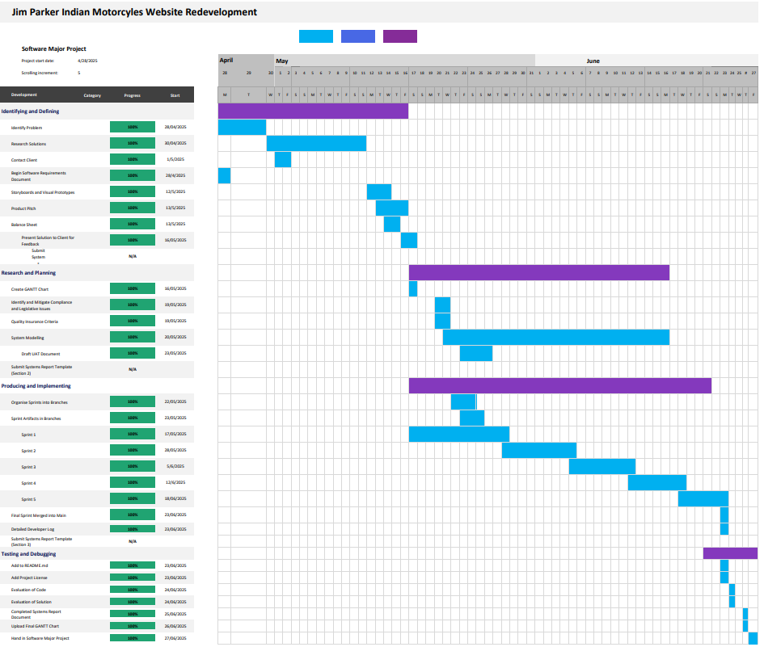

# Software Engineering Project - Jim Parker Indian Motorcycle Website Redevelopment

Here is the current website: https://www.parkerindian.com.au/index.html

## Project Overview

This project is part of the 2025 Software Engineering Major Project. The project involves the redevelopment of the Jim Parker Indian Motorcycle website from an outdated static website to a modern user interface with additional business activity features.

## Issues with existing website

- Outdated user interface
- Poor user experience
- Security vulnerabilities
- Static website
- Outdated content

## Plan for redevelopment

- Design and include favicon
- Change sidebar to navbar
- Redesign layout of pages (For sale, Sold, Gallery)
- Development must follow UX and UI design principles to ensure it becomes a modern application
- Implement an OOP method of displaying products and motorcycles on specific pages and dynamic URLs

## Redeveloped Website (Customer view)

<video controls src="JPI.mp4" title="JPI Customer View"></video>

## Redeveloped Website (Admin view)

<video controls src="JPI Admin.mp4" title="Title"></video>

## Final GANTT Chart

## Systems Report Document

Jim Parker Indian Website Redevelopment Documentation:
https://schoolsnsw-my.sharepoint.com/:w:/r/personal/ariya_vongsaiya209_education_nsw_gov_au/Documents/SE%20Project%20-%20Software%20Systems%20Report.docx?d=wd0ddde638e1d4dc1bc59a21ad362f555&csf=1&web=1&e=YapXaB

## Summary of Agile Sprints

### Sprint 1

Set up basic format of website, removed unused files and add new templates

- Update CSS styles with colour scheme: maroon and beige
- Add logo image and favicon.
- Removed default template form and privacy policy templates (PWA template from Tempe HS repository).
- Introduced a new 'For Sale' page to showcase vintage motorcycles.
- Enhanced navigation with navbar replacing side bar and an offcanvas menu for consistency in mobile usability
- Updated footer with contact information, company details and store location
- Added paths to gallery, for sale, about us, external links and home page

### Sprint 2

- Add new images and update templates for improved gallery and product display
- Added path to gallery and motorycles for sale with images
- Added multiple images for various models in forsale page (e.g. 1918 Powerplus, 1919 Powerplus, 1925 Indianscout, and others)
- Removed unused favicon and logo images
- Updated 'forsale.html' with product card layout and image handling
- Created a new 'gallery.html' template for displaying images in a grid layout
- Added'gallery_detail.html' and 'product_detail.html' as a dynamic URL with image carousel for detailed view of selected gallery and forsale images.
- Updated 'layout.html' to use dynamic URLs for CSS and JS files
- Created 'layout1.html' for pages without a navbar
- Updated footer to include more contact information and company logo
- Initialised new database file with 4 tables for gallery, images linked to motorcycles in gallery, motorcycles for sale and images of motorcycles for sale

### Sprint 3

- Add new images and update templates for improved layout and functionality
- Added multiple new images for various motorcycle models from 1926 to 1952
- Removed outdated 'menulogo.png' and added new images for services and background
- Updated 'forsale.html' to imrpove display of card layout and image handling
- Redesigned 'index.html' with a new hero section below header with business service offerings.
- Improved navigation menu in 'menu.html' for better accessibility and responsiveness
- Created new 'sold.html' and 'sold_detail.html' templates to display recently sold motorcycles
- Improved layout and styles across templates better UX

### Sprint 4

- Added new motorcycle addition form in cards.html with fields for model, price, description, location, year, contact, and image uploads.
- Updated index.html to improve styling in header
- Replaced website logo in layout.html and footer.html with a new footer logo (due to copyright issues in the past)
- Introduced a login page in login.html with authentication, specifically for admins only
- Updated menu.html to include logo and adjusted navbar styles
- Removed old logos from the project and added new images
- Fixed sold_detail.html to correctly display the price instead of location

### Sprint 5
Add user management and QR code functionality:

- Implemented user input sanitization in sv_user.py to prevent SQL injection.
- Created adduser.html for adding new admin users with password validation.
- Updated cards.html and gallery.html with back navigation and improved titles.
- Enhanced login.html with password visibility toggle and changed submit button text to "Login".
- Added qrcode.html for two-factor authentication with QR code scanning.
- Updated sold.html with a description for recently sold motorcycles.
- Created userhome.html for user dashboard with options to add admin and motorcycle.
- Added new styles for user home buttons in style.css.
- Included a new QR code image in static directory.
